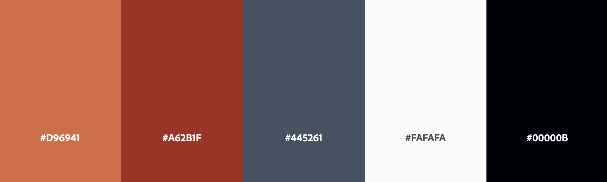

# EFH - Eating From Home

![Am I Responsive]

EFH - Eating From Home is a web application built with Django that aims to help individuals working from home save time and eat healthier by providing meals inspirations in a platform where you can create and manage your own recipes just like a granny's book.

In a work-from-home environment, finding time to prepare healthy meals can be challenging. EFH web application addresses this by empowering users to take control of their diet and make healthier eating choices. By using My Recipe Book, you can save time, stay organized, descover new ideas and much more.

- - -

## CONTENTS (summary)

- - -

## User Experience (UX)

An user for EFH app would likely be an adult professional working from home, looking to save time and make healthier food choices, maintaining a healthy lifestyle while working. 
Our main visitor will be people who want to optimize their time and prioritize their well-being.

### User Stories - Epics
**Site Administration**
- As a Site Admin I can approve or disapprove comments so that I can moderate comments
- As a Site Admin I can create, read, update and delete recipes so that I can manage my community content 
- As a Site Admin I can create draft recipes so that I can finish writing the content later

**User Interaction**
- As a Site User I can view the number of likes on each recipe so that I can see which is the most popular
- As a Site User I can like or unlike a recipe so that I can interact with the content
- As a Site User I can leave comments on a recipe so that I can get involved in a conversation

**User Profile**
- As a Site User I can register an account so that I can interact with the community and manage my own recipes

**Recipe Management**
- As a Site User I can create, read, update and delete my recipes so that I can manage my content
- As a Site User I can view a paginated list of recipes so that easily select a recipe to view
- As a Site User I can click on a recipe so that I can read the full recipe

**User Stories not implemented**

The user Storie bellow were removed from the project due time was running short. The intentions are  to implement it in the future.
- As a Site User I can publish my recipes so that I can share my own recipes
- As a Site Admin I can approve or disapprove recipes so that I can moderate the content

### Design
With a minimalist and user-friendly interface, we have carefully crafted the design to ensure user can effortlessly navigate through the application and focus on what matters most: preparing a delicious and healthy lunch.

**-Colour Scheme**

Color theme from Adobe Color

 Carefully chosen a soothing color palette that complements our mission of making your lunchtime routine a stress-free and pleasant experience.
 There are strong contrast between background colors and text throughout our web application, ensuring maximum readability and usability for all users.
 
