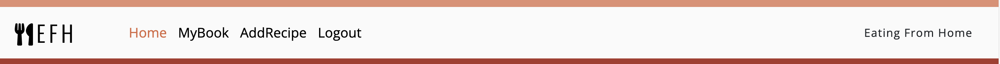

# EFH - Eating From Home

![Am I Responsive]

EFH - Eating From Home is a web application built with Django that aims to help individuals working from home save time and eat healthier by providing meals inspirations in a platform where you can create and manage your own recipes just like a granny's book.

In a work-from-home environment, finding time to prepare healthy meals can be challenging. EFH web application addresses this by empowering users to take control of their diet and make healthier eating choices. By using My Recipe Book, you can save time, stay organized, descover new ideas and much more.

- - -

## CONTENTS (summary)

- - -

## User Experience (UX)

An user for EFH app would likely be an adult professional working from home, looking to save time and make healthier food choices, maintaining a healthy lifestyle while working. 
Our main visitor will be people who want to optimize their time and prioritize their well-being.

### User Stories - Epics
**Site Administration**
- As a Site Admin I can approve or disapprove comments so that I can moderate comments
- As a Site Admin I can create, read, update and delete recipes so that I can manage my community content 
- As a Site Admin I can create draft recipes so that I can finish writing the content later

**User Interaction**
- As a Site User I can view the number of likes on each recipe so that I can see which is the most popular
- As a Site User I can like or unlike a recipe so that I can interact with the content
- As a Site User I can leave comments on a recipe so that I can get involved in a conversation

**User Profile**
- As a Site User I can register an account so that I can interact with the community and manage my own recipes

**Recipe Management**
- As a Site User I can create, read, update and delete my recipes so that I can manage my content
- As a Site User I can view a paginated list of recipes so that easily select a recipe to view
- As a Site User I can click on a recipe so that I can read the full recipe

**User Stories not implemented**

The user Storie bellow were removed from the project due time was running short. The intentions are  to implement it in the future.
- As a Site User I can publish my recipes so that I can share my own recipes
- As a Site Admin I can approve or disapprove recipes so that I can moderate the content

### Design
With a minimalist and user-friendly interface, we have carefully crafted the design to ensure user can effortlessly navigate through the application and focus on what matters most: preparing a delicious and healthy lunch.

**-COLOUR SCHEME**

Color theme from Adobe Color

 Carefully chosen a soothing color palette that complements our mission of making your lunchtime routine a stress-free and pleasant experience.
 There are strong contrast between background colors and text throughout our web application, ensuring maximum readability and usability for all users.
 
**-TYPOGRAPHY**
 
Google Fonts was used to import the chosen fonts below for use in the application.

CSS rules to specify families

font-family: 'Open Sans', sans-serif;

font-family: 'Oswald', sans-serif;

        
**-IMAGERY**

All imagery used within the site has been chosen from [pexel](https://www.pexels.com) taken by the photographers bellow:

Photos by: 

- [Jess Ho](https://www.pexels.com/@jess-ho-51667983/)
- [Kaju](https://www.pexels.com/@kaju-102944731/)
- [Nicola Barts](https://www.pexels.com/@nicola-barts/)

The rest of the imagery will be uploaded by users for their individual recipes.

**-WIREFRAMES**

Landing Page

 )

My Book Page

 

Add Recipe Page

 

## Agile Methodology

Github project was used to manage the development process of this project using an agile approach. 
Find the link to the Github project [here](https://github.com/users/Marcosmgs/projects/3/views/1) 

The  EFH Community User Stories is documented within the Github project. A Github issue was created for each user stories and allocated to the Project. 
The user stories were moved accordingly the application was been built.  

## Data Model

The views in this project have been organized into classes, following the OOP paradigm. 
Each class represents a specific action or behavior, allowing for clear and modular code structure.

To facilitate user interaction a comment feature was implemented using the Comment model. 
Each comment is associated with a particular recipe through a foreign key relationship to ensures that a comment can only be linked to one recipe.

[Django AllAuth](https://django-allauth.readthedocs.io/en/latest/) was used for user authentication. 
This powerful authentication system provides a seamless and secure user login and registration process, enhancing the overall user experience.

To enable users to create their own recipes, a Recipe model has been implemented. 
The author of each recipe is represented by a foreign key reference to the User model, ensuring that each recipe is associated with a single author.

Additionally a like model have implemented to allow users to express their appreciation for recipes in the inspiration section.

The diagram below details the database schema.

Entity relationship diagram was created using [Lucid Chart](https://www.lucidchart.com/) shows the schemas for each of the models and how they are related.

## Features

**Header**

**- Navigation Bar**
* The navigation bar in EFH provides convenient access to different sections of the web application
* The navigation bar is responsive and adapts to different screen sizes.
* On smaller displays, such as mobile devices, it transforms into a hamburger menu, ensuring easy navigation and saving valuable screen space.
* When user is logged in the navigation bar features my book and add recipes for registered users.

**- Logo**
* It features a distinctive logo
* An utensil icon with the text EFH representing Eating From Home to enhance brand recognition

**Footer**

* The footer section of EFH is displayed across all web pages, providing important information and encouraging user engagement.
* To enhance user interaction, social media icons are included, allowing users to easily connect with EFH on various platforms.
* Social media icons link to EFH's official social media pages, providing users with additional avenues to stay connected, receive updates, and access more content.

**Home Page**

**- Welcome Section**

* The hero section of EFH homepage sets the stage for an exciting culinary journey.
* With a captivating background image, the section immediately grabs the user attention.
* Overlaid on the image is a transparent text box that contains our mission and an welcoming message.

**- Why Join Us Section**
* The Reasons to Join Us section is featured on the homepage.
* It displays our main points that make EFH community interesting and encourages users to join and engage.
* There are four main points highlighted through visually appealing cards: Healthy Habits, Inspiration, Save Time and Community.

## Future Features

The following user stories were removed from the project as time was very short by the end of the project. The intentions are to implement it in the future.

* As a Site User I can publish my recipes so that I can share my own recipes
* As a Site Admin I can approve or disapprove recipes so that I can moderate the content

## Languages

* Python
* Javascript
* HTML
* CSS

## DEPLOYMENT

This website has been deployed to [Heroku](https://dashboard.heroku.com/apps) following these steps:

**Create the Heroku App**

1. Log in to your Heroku account and, after clicking on the New button in the top-right corner of the page, select the Create new app option from the dropdown menu.
2. Insert an app name and choose a region (Europe or United States) and click on the Create app button.
3. From the Settings, click "Reveal Config Vars"
4. Add a Config Var called DATABASE_URL and give it the value of the ElephantSQL database URL created.
5. Add a Config Var called PORT with value 8000

**Attach the Postgres database**

6. In the terminal, create the env.py file on the top level directory, setting in it the environment variables and adding in the secret key
7. In Heroku, add SECRET_KEY to Config Vars
8. PREPARE THE ENVIRONMENT AND SETTINGS.PY FILE
9. Reference env.py file in settings.py file
10. Replace the insecure secret key, linking it with the one declared in the Config Vars in Heroku, comment out the default database section and add the new database section the links to the DATABASE_URL in Heroku
11. Save all files and in the terminal make the migrations

**Get static and media files stored in Cloudinary**

12. Copy the CLOUDINARY_URL from Cloudinary and add it to the env.py file
13. Add CLOUDINARY_URL Config Var in Heroku
14. Add DISABLE_COLLECTSTATIC with value of 1 to the Config Vars in Heroku
15. In settings.py file, add Cloudinary Libraries to the INSTALLED_APPS
16. Tell Django to use Cloudinary to store media and static files
17. Link file to the templates directory in Heroku
18. Change the templates directory to TEMPLATES_DIR
19. Add Heroku Hostname to ALLOWED_HOSTS

**Create Files**

20. Create 3 new folders on the top level directory: media, static, templates
21. Create a Procfile on the top level directory
22. In the Procfile, add the code: web: gunicorn PROJ_NAME.wsgi
23. Save all files; add, commit and push to Github

**Deployment**

24. **_IMPORTANT_**: Set Debug to False in settings.py file
25. Add the setting X-FRAME_OPTIONS = 'SAMEORIGIN' to settings.py file for Summernote
26. In Heroku, delete the Config Var DISABLE_COLLECTSTATIC
27. Go to the Deploy Tab and, scrolling down, either Enable Automatic Deploys or Manually Deploy by selecting the chosen branch and clicking on Deploy Branch
28. VIEW LIVE SITE The site is up and running and can be viewed by clicking on the Open app button on the top right side of the project's window on Heroku.

## Credits

Code
* Code Institute for the Walkthrough Projects
* Tutorial on Hello [Django project](https://github.com/Code-Institute-Solutions/Django3blog) from Code Institute.
* Code Institute for the CI Python Linter used throughout the project at every stage of the building.
*  [AutoSlugField](https://django-extensions.readthedocs.io/en/latest/field_extensions.html)
* [StackOverflow ](https://stackoverflow.com/)

Content
* Recipes were taken from [BBC Good Food](https://www.bbcgoodfood.com/)

Media
* Code Institute for the README.md file tutorial.
* Code Institute for the project template CI Template
* Imagery on this site were taken from [Pexels](https://www.pexels.com/)

## Acknowledgments

* My Mentor Jubril Akolade for his patience and helpful feedback.
* Slack Community my fellow students, as well as mentors and CI staff.
