# EFH - Project app Testing

## Content

## Manual Testing

### Navigation
| Test  | Action | Expected Results  | Pass/Fail |
| ------------- | ------------- | ------------- | ------------- |
| Home link  | Click on the Home link in the navigation bar  | The page should navigate to the home page  | Pass  |
| MyBook link (when the user is authenticated) | Click on the MyBook link in the navigation bar  | The page should navigate to the users book page  | Pass  |
| AddRecipe link (when the user is authenticated)  | Click on the AddRecipe link in the navigation bar  | The page should navigate to the add recipe page  | Pass  |
| Logout link (when the user is authenticated)  | Click on the Logout link in the navigation bar  | The user should be logged out and redirected to the logout page  | Pass  |
| Register link (when the user is not authenticated)  | Click on the Register link in the navigation bar  | The page should navigate to the registration page  | Pass  |
| Login link (when the user is not authenticated)  | Click on the Login link in the navigation bar  | The page should navigate to the login page  | Pass  |

### Index Page
| Test  | Action | Expected Results  | Pass/Fail |
| ------------- | ------------- | ------------- | ------------- |
| Welcome Message  | Open the index page  | Welcome to Eating From Home!! along with the description should be displayed.  | Pass  |
| Reasons to Join Us  | Open the index page  | Four cards should be displayed with titles and descriptions  | Pass  |
| Inspiration Corner  | Open the index page  | A list of recipe cards should be displayed. Each card should contain an image(placeholder or a recipe featured image) author name, recipe title, excerpt, creation date and the number of likes.| Pass  |
| Pagination List  | If the recipe list has more than the default number of entries per page  | Pagination links should be displayed at the bottom, allowing navigation to previous and next pages  | Pass  |
| Pagination Single  | If the recipe list has fewer entries than the default number  | No pagination links should be displayed  | Pass  |
| Title Recipe Details Link  | Click on a recipe card title  | The page should navigate to the detailed view of the clicked recipe  | Pass  |

### My Book Page(when the user is authenticated) 
| Test  | Action | Expected Results  | Pass/Fail |
| ------------- | ------------- | ------------- | ------------- |
| Add Recipe Button  | Click on the Add Recipe button  | The user should be redirected to the add recipe page  | Pass  |
| Recipe List  | Open the my book page  | A list of recipe cards should display, each card contain an image(placeholder or featured image) author name, recipe title, options to edit and delete the recipe, and the creation date  | Pass  |
| Pagination List  | If the user book has more than the default number of entries per page  | Pagination links should be displayed at the bottom, allowing navigation to previous and next pages  | Pass  |
| Pagination Single  | If user book list has fewer entries than the default number  | No pagination links should be displayed  | Pass  |
| Recipe details link  | Click on a recipe cards title   | The page should navigate to the detailed view of the clicked recipe  | Pass  |
| Edit Recipe Button  | Click on the Edit button of a recipe card  | The user should be redirected to the edit recipe page for the selected recipe  | Pass  |
| Delete Recipe Button  | Click on the Delete button of a recipe card  | The user should be prompted to confirm the deletion of the recipe  | Pass  |

### Recipe Details Page
| Test  | Action | Expected Results  | Pass/Fail |
| ------------- | ------------- | ------------- | ------------- |
| Display Recipe Details  | Open the recipe details page  | All the recipe details are correctly displayed on the page  | Pass  |
| Recipe Description  | Open the recipe details page  | The recipe description is correctly displayed on the page  | Pass  |
| Display Ingredients  | Open the recipe details page  | The recipe ingredients are correctly displayed on the page  | Pass  |
| Display Method  | Open the recipe details page  | The recipe method is correctly displayed on the page  | Pass  |
| Display Comments  | Open the recipe details page that has comments  | All comments are correctly displayed with the commenter's name, comment content, and creation date  | Pass  |
| Submit Comment  | If authenticated, leave a comment using the comment form  | The comment is displayed in the comments section, awaiting approval  | Pass  |
| Like Button Functionality  | If authenticated, click the like button  | The like count increases, and the button reflects the users action liked or unliked  | Pass  |
| Image Display  | Open the recipe details page | The placeholder image or featured image is correctly displayed on the page  | Pass  |
| Proper Formatting and Styling  | Open the recipe details page on different devices with varying screen sizes  | The page layout, formatting, and styling are consistent and responsive on different devices  | Pass  |

### User Recipe Details Page(when the user is authenticated) 
| Test  | Action | Expected Results  | Pass/Fail |
| ------------- | ------------- | ------------- | ------------- |
| Display Recipe Details  | Open users recipe details page  | All the recipe details are correctly displayed on the page  | Pass  |
| Recipe Description  | Open users recipe details page  | The recipe description is correctly displayed on the page  | Pass  |
| Display Ingredients  | Open users recipe details page  | The recipe ingredients are correctly displayed on the page  | Pass  |
| Display Method  | Open users recipe details page  | The recipe method is correctly displayed on the page  | Pass  |
| Image Display  | Open users recipe details page  | The placeholder image or featured image is correctly displayed on the page  | Pass  |

### Add Recipe Page(when the user is authenticated) 
| Test  | Action | Expected Results  | Pass/Fail |
| ------------- | ------------- | ------------- | ------------- |
| Form Rendering  | Open Add Recipe page  | The form should be rendered correctly with all the specified fields  | Pass  |
| Submiting Form  | Fill in and Submit the Add Recipe Form  | Redirects User to My Book and return message that the form data is successfully submitted  | Pass  |
| Field Validation  | Submit the form without filling in any of the required fields  | Redirect to field or error messages are displayed for required field that was left empty  | Pass  |
| File Upload  | Select a file for the featured image field  | The selected file for the featured image field is uploaded successfully  | Pass  |

## Code Validation

### W3C HTML VALIDATION
All html pages have been run through the [W3C HTML Validator](https://validator.w3.org/) and the below results were returned.

**- index.html**
* Erros = None.
* Warnings = None.
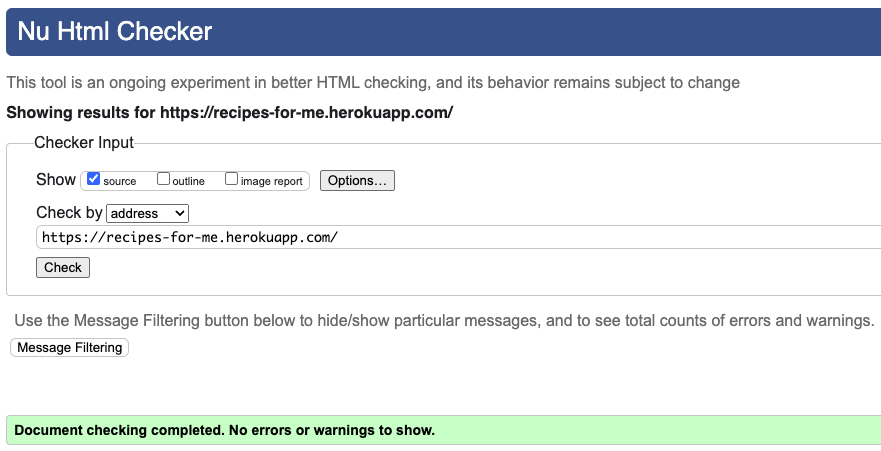

**- my_book.html**
* Erros = None.
* Warnings = None.
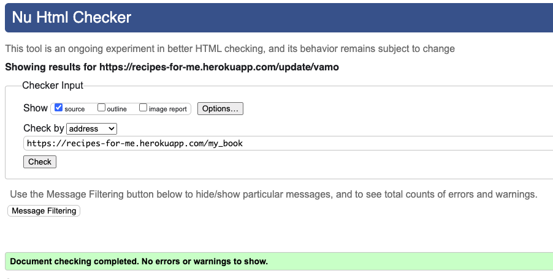

**- addrecipe.html**
* Erros = None.
* Warnings = None.
* 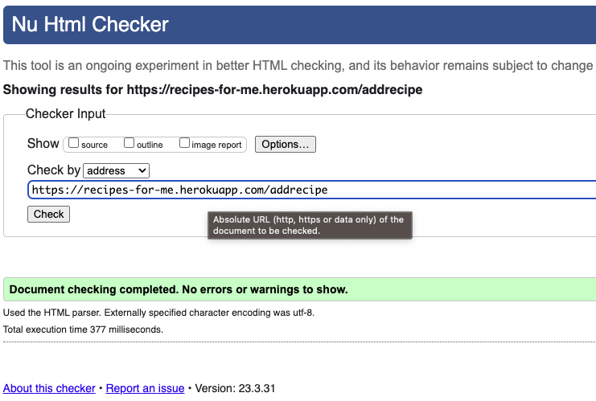

**- edit.html**
* Erros = None.
* Warnings = None.
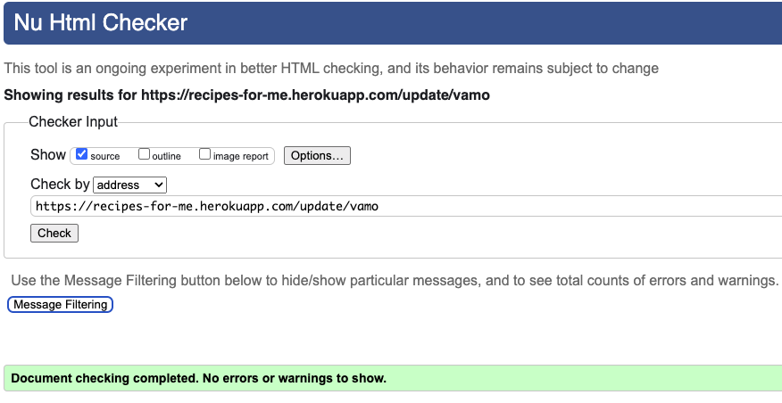

**- recipe_details.html**
* Erros = None.
* Warnings = None.
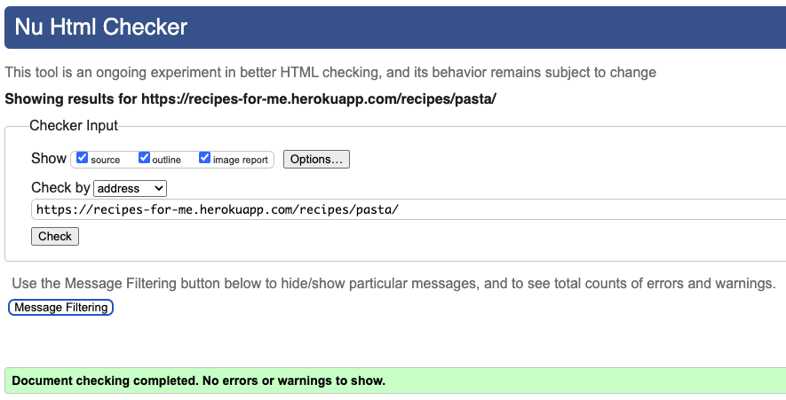

**- single.html**
* Erros = None.
* Warnings = None.
* 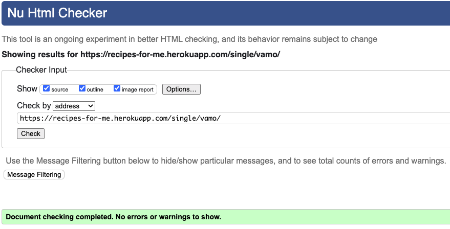

**- login.html**
* Erros = None.
* Warnings = None.
* 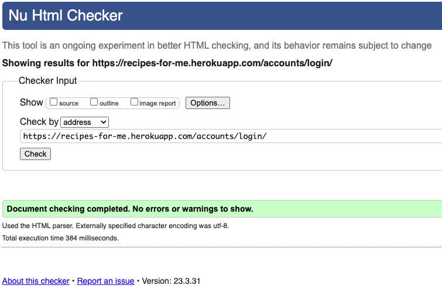

**- signup.html**
* Erros = None.
* Warnings = None.
* 

## Jigsaw CSS VALIDATION
No errors or warnings are returned when passing the styles.css through the [Jigsaw CSS Validator](https://jigsaw.w3.org/css-validator/).

* 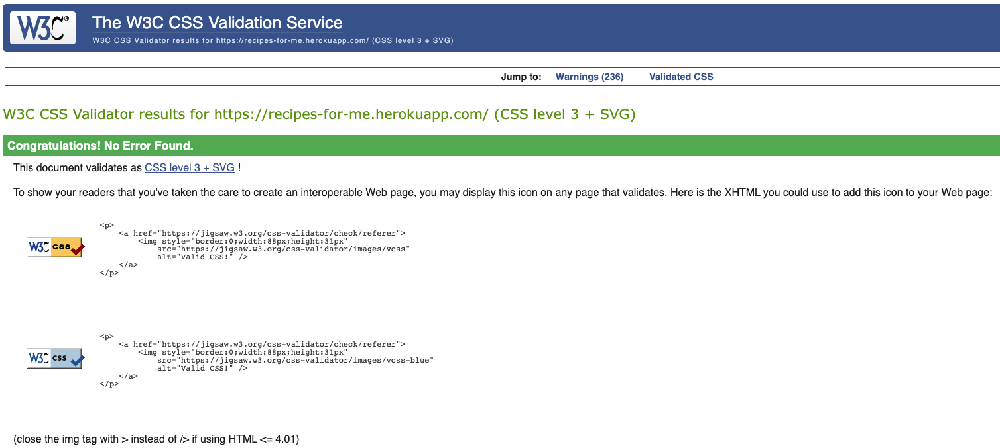

## JSHint JavaScript VALIDATION
All the sripts used in EFH have been run through the [JSHint Javascript Validator](https://jshint.com/) and they return no errors.

* 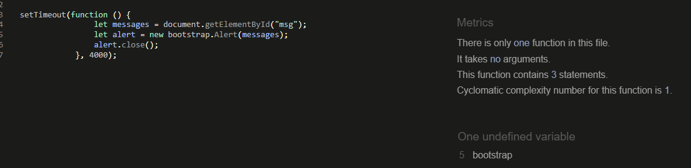

## CI Python Linter Python VALIDATION 
All the main Python files were run through the [CI Python Linter Validator](https://pep8ci.herokuapp.com/) with no errors returned.

**- forms.py**
* Erros = None.
* 

**- models.py**
* Erros = None.
* 

**- urls.py**
* Erros = None.
* 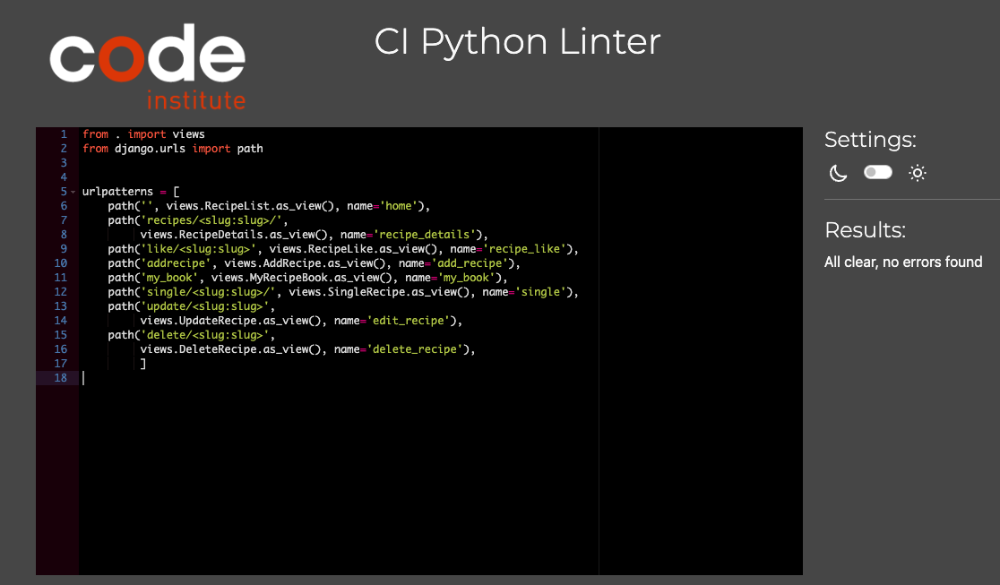

**- views.py**
* Erros = None.
* 

## LIGHTHOUSE REPORTS
EFH app home page have been tested for Performance, Accessibility, Best Practices and SEO using [Lighthouse Chrome Developer Tool](https://developer.chrome.com/docs/lighthouse/overview/).
The lighthouse scores look very good overall, with some things that could be improved. A future implementation would be to convert all images to the webp format.

**- Home Page**
* Performance = 72
* Accessibility = 98
* Best Practices = 100
* SEO = 100
* 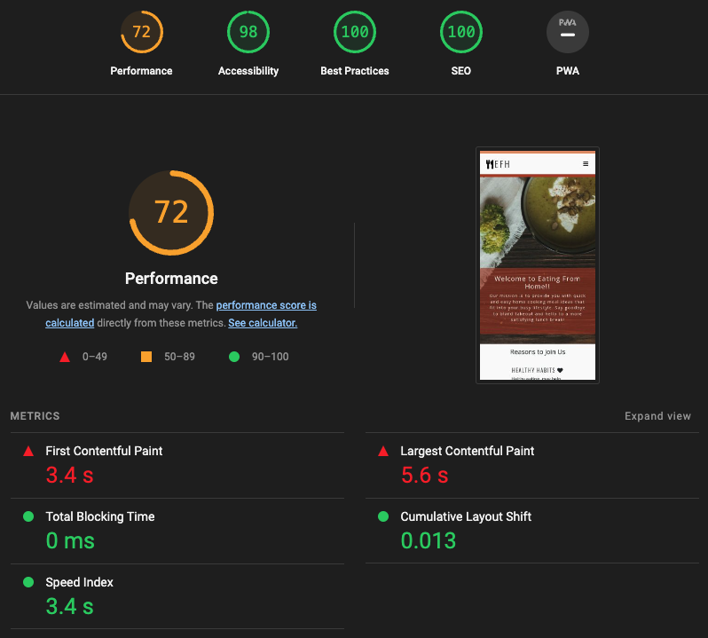
