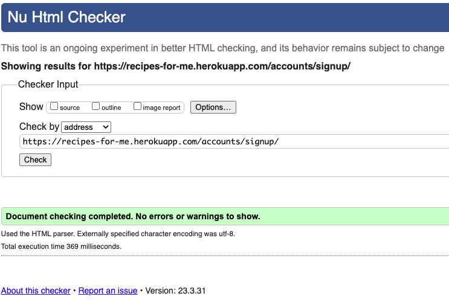
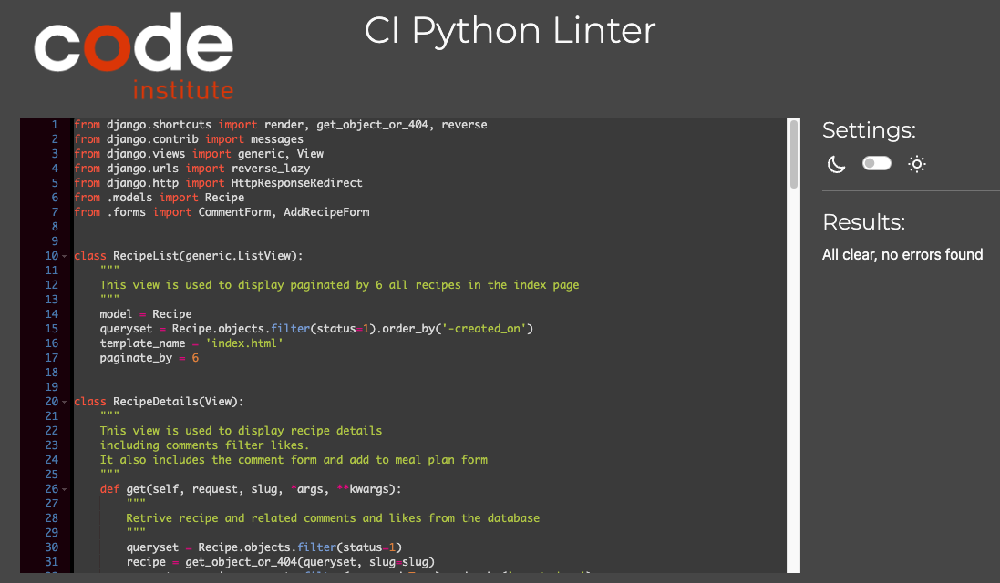

# EFH - Project app Testing

## Content

## Code Validation

### W3C HTML VALIDATION
All html pages have been run through the [W3C HTML Validator](https://validator.w3.org/) and the below results were returned.

**- index.html**
* Erros = None.
* Warnings = None.

**- my_book.html**
* Erros = None.
* Warnings = None.

**- addrecipe.html**
* Erros = None.
* Warnings = None.
* 

**- edit.html**
* Erros = None.
* Warnings = None.

**- recipe_details.html**
* Erros = None.
* Warnings = None.

**- single.html**
* Erros = None.
* Warnings = None.
* 

**- login.html**
* Erros = None.
* Warnings = None.
* 

**- signup.html**
* Erros = None.
* Warnings = None.
* 

## Jigsaw CSS VALIDATION
No errors or warnings are returned when passing the styles.css through the [Jigsaw CSS Validator](https://jigsaw.w3.org/css-validator/).

* 

## JSHint JavaScript VALIDATION
All the sripts used in EFH have been run through the [JSHint Javascript Validator](https://jshint.com/) and they return no errors.

* 

## CI Python Linter Python VALIDATION 
All the main Python files were run through the [CI Python Linter Validator](https://pep8ci.herokuapp.com/) with no errors returned.

**- forms.py**
* Erros = None.
* 

**- models.py**
* Erros = None.
* 

**- urls.py**
* Erros = None.
* 

**- views.py**
* Erros = None.
* 
